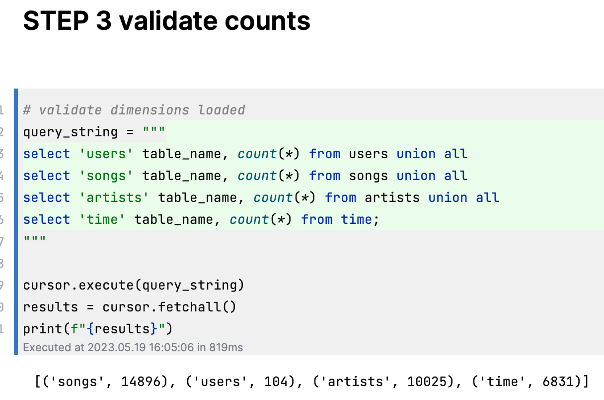
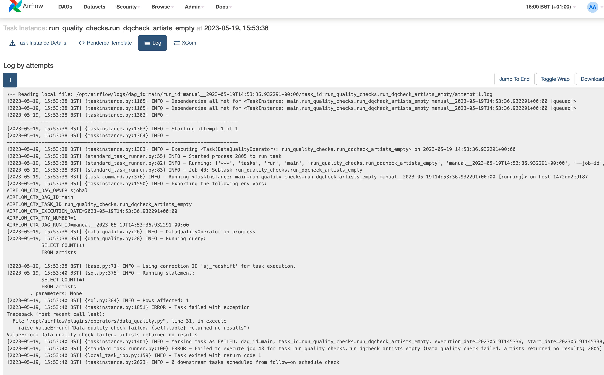
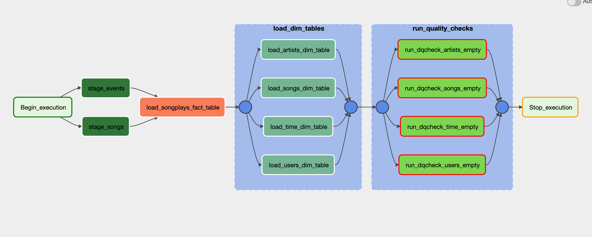

# Purpose

This is a Udacity Project where the directive was:

1. Use the helper dag to kickstart the project
2. Build operators to stage, transform and run DQ checks
   3. Stage Operator
   4. Fact and Dimension Operators
   5. Data Quality Operator

# Run
## Setup
1. Build Redshift Cluster `setup > cfn > scripts > cfn_build_and_teardown.sh` which uses `setup > cfn > multi-node-cluster.yaml`
2. Run docker container `airflow-local-env start`
2. Create tables by running dag `setup_create_tables.py`

# Deliverables
## Fact & Dimension Tables Loaded

## Data Quality Checks

## Main DAG

